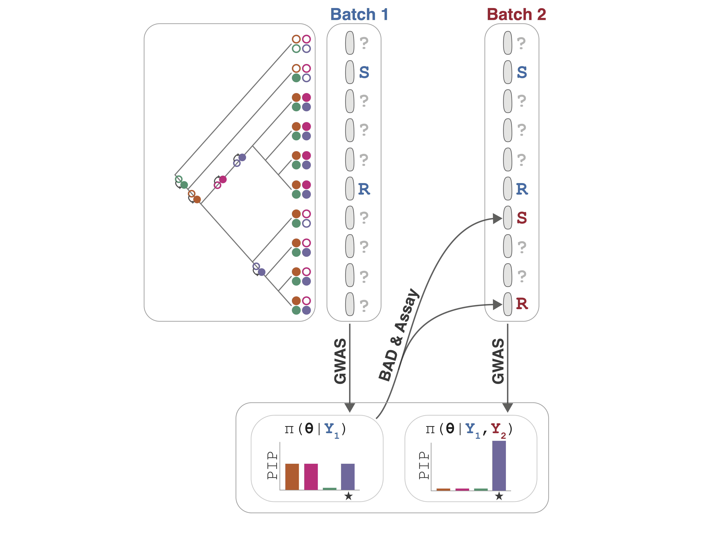

# **B**ayesian **A**daptive **S**equential **S**ampling for (bacterial)**GWAS**

   

## Contents
  * [Introduction](#introduction)
  * [Installation](#installation)
    * [Required dependencies](#required-dependencies)
    * [Helper script dependencies](#helper-script-dependencies)
    * [Package installation](#package-installation)
  * [Usage](#usage)
      * [Data preprocessing](#data-preprocessing)
      * [GWAS](#gwas)
      * [Experimental Design](#experimental-design)
  * [Feedback/Issues/Help](#feedback/issues/help)
  * [License](#license)
  * [Citation](#citation)

## Introduction
BASSGWAS (Bayesian Adaptive Sequential Sampling for (bacterial) GWAS) is a framework for efficient bacterial genome wide association studies (GWAS) which require phenotyping. BASSGWAS combines a sparse whole-genome regression model with Bayesian adaptive experimental design to select batches of isolates from a large, sequenced collection for iterative experimental phenotyping. By incorporating information from past iterations together and the distribution of variants to select isolates for BASSGWAS can achieve substantial reduction in the number of experimental measurements needed to power a GWAS study. See the [preprint](LINK) for benchmarks and details.

### Workflow diagram
*BASSGWAS worklow*

BASSGWAS is useful when:
1. You want to find the genetic basis of some observed phenotypic variation.
2. You have prior evidence of phenotypic variation.
3. You need to do phenotyping yourself.
4. You have access to a large sequenced collection of (at least several hundred) isolates you can phenotype.

Additionally, the underlying sparse regression model can be used for finemapping **independent of experimental design functionality**. Currently, only binary phenotypes are supported. 

## Installation
See the [tutorial](docs/tutorial.md) before use.
### Required dependencies
The BASSGWAS package requires `julia>=1.11`. 
### Helper script dependencies
The scripts in the `helper_scripts` directory require a working `R` installation together with the following packages:
- `Rapp`
- `tidyverse`
- `ape`
### Package installation
Usen the `julia` package manager to install BASSGWAS from `github`: `] add https://github.com/dhelekal/BASSGWAS.git:BASSGWAS`
## Usage
Using BASSGWAS requires a variant presence-absence file together with a phylogeny that describes the population structure. **See the [tutorial](docs/tutorial.md) before use**.
### Data preprocessing
To prepare the inputs for use with BASSGWAS use:

`prepare_data.R [variant_file.csv] [tree_file.nwk] --odir [OUTPUT_DIRECTORY] [--svd-threshold 0.99] [--af-threshold 0][--to-drop NAMES_TO_DROP.txt]` 

This will generate the necessary GWAS and design input files in the output directory `--odir`.

### GWAS 
To run GWAS use:

`julia bassgwas-run.jl --pfile [patterns_centred.csv] --ufile [U.csv] --sfile [S.csv] --obsfile [obs.csv] --odir [OUTPUT_DIRECTORY] --batchsz [BATCH_SIZE] [--inclnext INCLNEXT.txt] [--seed 0] [--ndraws 1000] [--nthin 500] [--nchains 1] [--p_mean 5.0] [--pr_0 0.25] [--randdes]`.

This will write posterior draws and the experimental design to the output directory. Setting `--batchsz 0` will disable experimental design and run gwas only.

### Experimental design
Experimental design can be enabled by setting the batch size argument in `bassgwas-run.jl` argument to a non-zero value. Alternatively, experimental design can be run standalone, using posterior draws from a prior GWAS run:

`julia bassgwas-design.jl --pfile [patterns_centred.csv] [U.csv] --sfile [S.csv] --obsfile [obs.csv] --b_draws [b_draws.csv] --u_draws [u_draws.csv] --par_draws [par_draws.csv] --ofile [output_file.txt] --batchsz [batch_size] [--inclnext INCLNEXT.txt]` 

# Feedback/Issues/Help
Please submit a github issue or get in touch by email `david.helekal@gmail.com`

# License 
GNU GPL-3

# Citation
See preprint

