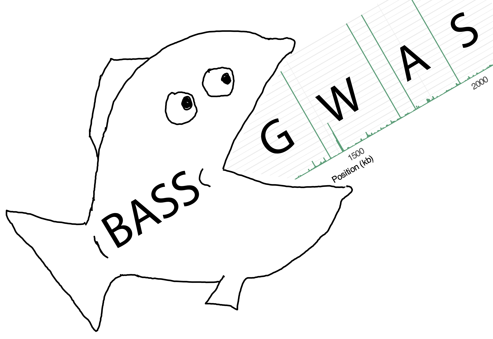

# BASS-GWAS 
**B**ayesian **A**daptive **S**equential **S**ampling for (bacterial) **GWAS**

[](https://github.com/dhelekal/BASSGWAS/blob/main/LICENSE)   

<div id="toc"> <!-- both work, toc or user-content-toc -->
  <ul style="list-style: none;">
    <summary>
      <h2><b>Contents</b></h2>
    </summary>
  </ul>
</div>

  * [Introduction](#introduction)
  * [Installation](#installation)
    * [Required dependencies](#required-dependencies)
    * [Helper script dependencies](#helper-script-dependencies)
    * [Package installation](#package-installation)
  * [Usage](#usage)
      * [Data preprocessing](#data-preprocessing)
      * [GWAS](#gwas)
      * [Experimental Design](#experimental-design)
  * [Feedback/Issues/Help](#feedbackissueshelp)
  * [License](#license)
  * [Citation](#citation)


## Introduction
BASS-GWAS (Bayesian Adaptive Sequential Sampling for (bacterial) GWAS) is a framework for efficient bacterial genome-wide association studies (GWAS) that require phenotyping. BASS-GWAS can select batches of isolates from a large, sequenced collection for iterative experimental phenotyping. To do this, it combines a sparse whole-genome regression model with Bayesian adaptive experimental design. BASS-GWAS reduces the number of experimental measurements needed to power GWAS by incorporating information from past iterations and the variant distribution. See the [preprint](LINK) for benchmarks and details.

### Workflow diagram


BASS-GWAS is useful when:
1. You want to find the genetic basis of some observed phenotypic variation.
2. You have prior evidence of phenotypic variation.
3. You need to do phenotyping yourself.
4. You have access to a large sequenced collection of (at least several hundred) isolates you can phenotype.

Additionally, the underlying sparse regression model can be used for fine-mapping **independently of experimental design functionality**. Currently, it supports only binary phenotypes. 

## Installation
See the [tutorial](docs/tutorial.md) before use.

### Required dependencies
The BASS-GWAS package requires `julia>=1.11`. 

See the official [julia](https://julialang.org/) website for installation instructions.

### Helper script dependencies
The scripts in the `helper_scripts` directory require a working `R>=4.1.0` installation together with the following packages:
- `Rapp>=0.3.0` 
- `tidyverse`
- `ape`

### Package installation
Use the `julia` package manager to install BASS-GWAS from `github`:

```using Pkg; Pkg.add(url="https://github.com/dhelekal/BASSGWAS", subdir="BASSGWAS")```

## Usage
BASS-GWAS requires a variant presence-absence file and a phylogeny that describes the population structure. **See the [tutorial](docs/tutorial.md) before use**.

### Data preprocessing
To prepare the inputs for use with BASSGWAS use:

`prepare_data.R [variant_file.csv] [tree_file.nwk] --odir [OUTPUT_DIRECTORY] [--svd-threshold 0.99] [--af-threshold 0][--to-drop NAMES_TO_DROP.txt]` 

This will generate the necessary GWAS and design input files in the output directory `--odir`.

### GWAS 
To run GWAS use:

`julia bassgwas-run.jl --pfile [patterns_centred.csv] --ufile [U.csv] --sfile [S.csv] --obsfile [obs.csv] --odir [OUTPUT_DIRECTORY] --batchsz [BATCH_SIZE] [--inclnext INCLNEXT.txt] [--seed 0] [--ndraws 1000] [--nthin 500] [--nchains 1] [--p_mean 5.0] [--pr_0 0.25] [--randdes]`.

This will write posterior draws and the experimental design to the output directory. Setting `--batchsz 0` disables experimental design and runs GWAS only.

### Experimental design
Enable experimental design by setting the batch size argument in `bassgwas-run.jl` to a non-zero value. Alternatively, run experimental design as a standalone, using posterior draws from a prior GWAS run:

`julia bassgwas-design.jl --pfile [patterns_centred.csv] [U.csv] --sfile [S.csv] --obsfile [obs.csv] --b_draws [b_draws.csv] --u_draws [u_draws.csv] --par_draws [par_draws.csv] --ofile [output_file.txt] --batchsz [batch_size] [--inclnext INCLNEXT.txt]` 

# Feedback/Issues/Help
Please submit a GitHub issue or get in touch by email `david.helekal@gmail.com`

# License 
GNU GPL-3

# Citation
See preprint

<sub>Logo design: David Helekal, Maria Theiss</sub>

