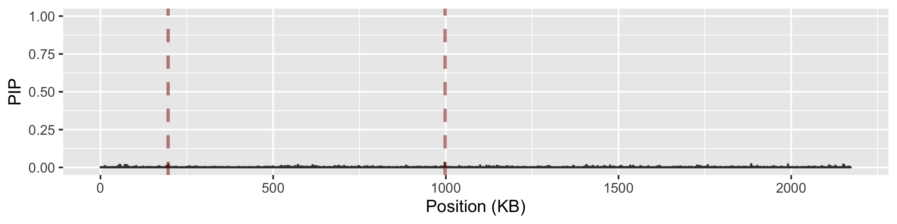
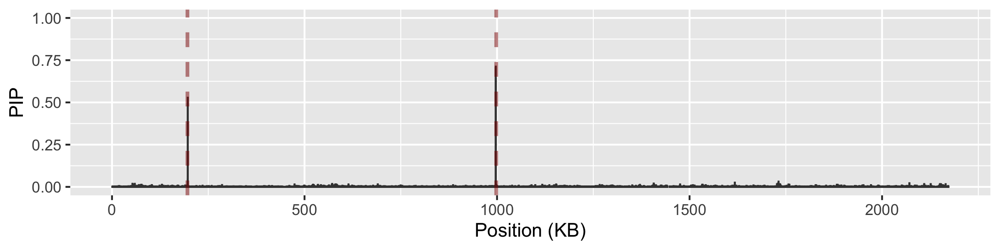
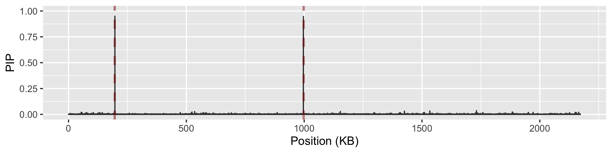

-   [Introduction](#introduction)
-   [Input Data](#input-data)
    -   [Note on Input Types](#note-on-input-types)
    -   [Inspecting the input data](#inspecting-the-input-data)
    -   [Preparing the inputs](#preparing-the-inputs)
-   [GWAS](#gwas)
    -   [`bassgwass-run.jl` usage](#bassgwass-run.jl-usage)
    -   [Running GWAS on a toy dataset](#running-gwas-on-a-toy-dataset)
    -   [Identifying associations](#identifying-associations)
-   [Adaptive experimental design](#adaptive-experimental-design)
    -   [Setup](#setup)
    -   [Adaptive design](#adaptive-design)
    -   [Additional functionality](#additional-functionality)
-   [Tips](#tips)

First we load the necessary libraries used in this tutorial

    library(ape)
    library(ggtree)
    library(tidyverse)
    library(ggplot2)

    set.seed(1)

    rm -r round0
    rm -r round1
    rm -r round2
    rm -r round3
    rm -r gwas_inputs
    rm -r gwas_outputs

**NOTICE: RE-RUNNING THIS TUTORIAL REQUIRES AT LEAST 32GB OF RAM AND 4
CPU CORES** **EXPECTED EXECUTION TIME: ~45MIN**

# Introduction

This tutorial assumes that you have previously downloaded the helper &
launch scripts in this repository. The first section of the tutorial
covers the general usage of the GWAS model. The second section covers
adaptive experimental design.

Throughout this tutorial we will be using the toy data found in the
`sample_data` folder. This is a version of the ciprofloxacin resistance
benchmark datasets used in the manuscript modified to contain only
20,000 unique variants. The toy dataset uses *unitigs* to characterise
genetic variation.

# Input Data

Using BASSGWAS requires two main data files: a variant presence-absence
file, and a phylogeny file in the newick formati. Both the phylogeny and
variant presence-absence should be constructed for the entire collection
at hand. The first column of the variant file should contain unique
variant identifiers. The remaining columns should each correspond to an
isolate, and the first row contain unique isolate identifiers:

<table>
<thead>
<tr>
<th>variant</th>
<th>isolate_1</th>
<th>isolate_2</th>
<th>isolate_3</th>
<th>…</th>
<th>isolate_n</th>
</tr>
</thead>
<tbody>
<tr>
<td>variant_1</td>
<td>1</td>
<td>1</td>
<td>0</td>
<td>…</td>
<td>1</td>
</tr>
<tr>
<td>variant_2</td>
<td>1</td>
<td>1</td>
<td>0</td>
<td>…</td>
<td>1</td>
</tr>
<tr>
<td>variant_3</td>
<td>0</td>
<td>1</td>
<td>1</td>
<td>…</td>
<td>0</td>
</tr>
<tr>
<td>…</td>
<td>…</td>
<td>…</td>
<td>…</td>
<td>…</td>
<td>…</td>
</tr>
<tr>
<td>variant_n</td>
<td>0</td>
<td>0</td>
<td>1</td>
<td>…</td>
<td>0</td>
</tr>
</tbody>
</table>

The isolate indentifiers must be shared between the variant file and the
phylogeny.

## Note on Input Types

Representing genetic variation in bacterial populations is an active
area of research. There are many distinct approaches, for example using
VCFs, unitigs, kmers, gene presence absence, etc. To ensure proper
functionality of BASSGWAS, the representation of genetic variation
should be both *comprehensive*, and *precise*. This is especially
important when using adaptive sequential sampling. Unitigs are usually a
good choice.

**DO NOT use adaptive sequential sampling with highly redundant
representations such as kmers**

**DO NOT use adaptive sequential sampling with gene presence absence
data alone**

## Inspecting the input data

The variant file in the toy dataset uses unitigs as variant identifiers
and `sra` accession numbers as isolate identifiers.

    vroom::vroom("../sample_data/variants.rtab",
        altrep=F, progress=F, show_col_types=F) %>%   
        print(n = 5, max_extra_cols = 0,width=60)

    ## # A tibble: 26,286 × 801
    ##   Unitig_sequence        SRR11698195 SRR11698198 SRR11698231
    ##   <chr>                        <dbl>       <dbl>       <dbl>
    ## 1 CATACCGGCGGGGGGGGGGGG…           0           0           0
    ## 2 CTTCAAGCAACGTAAACAAAG…           0           0           0
    ## 3 ACTTCTCTTCTCTTCTCTTCT…           0           0           0
    ## 4 CTAGATTCCCGCTTTCGCGGG…           0           0           0
    ## 5 AGAATGCCCTCTCCCCGGCCC…           0           1           1
    ## # ℹ 26,281 more rows

## Preparing the inputs

To generate the input files needed for use BASSGWAS, we will need to use
the data preprocessing script. First we will create a directory for
storing the generated input files.

    mkdir gwas_inputs

Next we will use the data preprocessing script `prepare_data.R` to
process the variant presence-absence file and the phylogeny into
BASSGWAS inputs. As a part of preprocessing, variant presence absence
patterns will be standardised, centred, and deduplicated. The phylogeny
is used to compute a factorised, low rank, similarity matrix.

`prepare_data.R` usage:

    Rapp ../helper_scripts/prepare_data.R --help

    ## Usage: prepare_data [OPTIONS] <VFILE> <TFILE>
    ## 
    ## Preprocess BASSGWAS input data
    ## 
    ## Options:
    ##   --odir <ODIR>                   Output directory.
    ##                                   [default: "."] [type: string]
    ##   --svd-threshold <SVD-THRESHOLD>  SVD truncation threshold
    ##                                   [default: 0.99] [type: float]
    ##   --af-threshold <AF-THRESHOLD>   Allele frequency filter threshold
    ##                                   [default: 0] [type: float]
    ##   --to-drop <TO-DROP>             Text file with isolate identifiers of
    ##                                   isolates to drop
    ##                                   [default: "NA"] [type: string]
    ## 
    ## Arguments:
    ##   <VFILE>  Variant presence absence tab-delimited file. Each row must
    ##            correspond to a variant. First column will be used as variant ID.
    ##            Column names must match sample names.
    ##   <TFILE>  Tree file in newick format. Tip names must match sample names.

-   `--af-threshold` can be used to set an optional allele frequency
    filter. Variants with frequency lower than this value will be
    discarded. Default: 0.
-   `--svd_threshold` controls the fraction of variance of the original
    phylogenetic correlation matrix that will be retained. Default:
    0.99.

We will now use the script to preprocess the toy data. To speed up
inference for the purposes of this tutorial, we will retain only 90% of
the variance

    Rapp ../helper_scripts/prepare_data.R ../sample_data/variants.rtab ../sample_data/tree.tre --odir gwas_inputs --svd_threshold 0.9

    ## 
    ## Attaching package: ‘ape’
    ## 
    ## The following object is masked from ‘package:dplyr’:
    ## 
    ##     where
    ## 
    ## Rows: 26286 Columns: 801
    ## ── Column specification ────────────────────────────────────────────────────────
    ## Delimiter: " "
    ## chr   (1): Unitig_sequence
    ## dbl (800): SRR11698195, SRR11698198, SRR11698231, SRR11698239, SRR11698255, ...
    ## 
    ## ℹ Use `spec()` to retrieve the full column specification for this data.
    ## ℹ Specify the column types or set `show_col_types = FALSE` to quiet this message.

This generated input files in the `gwas_inputs` directory. The following
two files are subsequently used with BASSGWASS:

-   `patterns_centred.csv` a centred, minorized, and deduplicated
    variant presence absence file for use with BASSGWAS.

-   `U.csv` & `S.csv` a low-rank factorisation of the correlation matrix
    implied by the phylogeny for use with BASSGWAS.

The `vars2patts.csv` file maps between the original variant identifiers
and the deduplicated variants that form `patterns_centred.csv`:

    vroom::vroom("gwas_inputs/vars2patts.csv",
        altrep=F, progress=F, show_col_types=F) %>%   
        print(unitigs, n = 4, max_extra_cols = 0,width=60)

    ## # A tibble: 26,286 × 3
    ##   pattern_id variant                         direction
    ##        <dbl> <chr>                               <dbl>
    ## 1          1 CATACCGGCGGGGGGGGGGGGGGGGGGGCGC         1
    ## 2          2 CTTCAAGCAACGTAAACAAAGAAATCCAAGA         1
    ## 3          3 ACTTCTCTTCTCTTCTCTTCTCTTCCCTTCC         1
    ## 4          4 CTAGATTCCCGCTTTCGCGGGAATGACGAAA         1
    ## # ℹ 26,282 more rows

-   `pattern_id` contains the column index in `patterns_centred.csv`.

-   `variant` contains the original variant identifier.

-   `direction` is equal to −1 if the original variant was complemented
    as 1 − *v*.

Additionally an uncentred, binary version of the pattern file was
generated as `patterns.csv`.

# GWAS

## `bassgwass-run.jl` usage

    bassgwas-run.jl --pfile PFILE --ufile UFILE --sfile SFILE
                    --obsfile OBSFILE --odir ODIR --batchsz BATCHSZ
                    [--inclnext INCLNEXT] [--seed SEED]
                    [--ndraws NDRAWS] [--nthin NTHIN]
                    [--nchains NCHAINS] [--p_mean P_MEAN]
                    [--pr_0 PR_0] [--randdes] [-h]

-   `--pfile` `patterns_centred.csv` variant file

-   `--ufile` `U.csv` left singular vectors for population structure
    correction

-   `--sfile` `S.csv` singular values for population structure
    correction

-   `--obsfile` observations file

-   `--odir` output directory

-   `--batchsz` batch size for experimental design. If set to 0,
    experimental design will be disabled

-   `--inclnext` path to a file listing isolate identifiers to include
    in the next experimental designs, one per line

-   `--seed` random seed. Default: `0`

-   `--n_draws` number of draws per chain. Default: `1000`

-   `--n_thin` thinning factor per draw. Default: `500`

-   `--n_chains` number of parallel chains to run. Default: `4`

-   `--p_mean` prior mean number of causal variants conditional on at
    least one effect. Default: `5`

-   `--pr_0` prior probability of 0 effects. Default: `0.25`

-   `--randdes` flag indicated a random design should be returned. You
    probably don’t want to use this.

-   `-h --help` print help and exit.

With the inputs ready, we can now run the GWAS model. BASSGWAS uses
efficient MCMC importance sampling and will create multiple files with
MCMC draws when finished, together with a file specifying a batch of
isolates for subsequent phenotyping if requested.

**NOTE the generated files are large. For 100k variants, 4000 draws
require approximately 60GB of storage**

## Running GWAS on a toy dataset

We will now demonstrate GWAS functionality on the toy dataset. The trait
in this dataset is high-level ( ≥ 1*μ**g* *m**L*−1)
ciprofloxacin resistance in *N. gonnorhea*. To attain this level of
resistance, at least one substitution in each of *gyrA* and *parC* genes
is required. The polygenic nature of this trait makes it challenging for
GWAS with binary phenotypes. We will run 2 chains in parallel each for a
total of 250 × 500 iterations. Moreover we will parallelize each chain
across 2 CPU cores using `julia -t2`. To speed things up, we will
downsample the full dataset to 200 isolates.

    dat_small <- read_csv("../sample_data/data_full.csv", progress=F, show_col_types=F) %>% 
        slice_sample(n = 200)
    dat_small %>% group_by(cip) %>% 
        summarise(count=n())

    ## # A tibble: 2 × 2
    ##   cip   count
    ##   <lgl> <int>
    ## 1 FALSE   179
    ## 2 TRUE     21

    dat_small %>% write_csv("gwas_inputs/data200.csv")

Inspect observations

    print(dat_small, n = 5, max_extra_cols = 0, width=60)

    ## # A tibble: 200 × 2
    ##   wgs_id      cip  
    ##   <chr>       <lgl>
    ## 1 SRR11724385 FALSE
    ## 2 SRR11698280 FALSE
    ## 3 SRR11699058 TRUE 
    ## 4 SRR16644250 FALSE
    ## 5 SRR16644352 FALSE
    ## # ℹ 195 more rows

We’re now ready to run BASSGWAS sampling. As the toy dataset only
contains 10000 variants, this should only take a few minutes.

    mkdir gwas_outputs
    julia -t2 ../bassgwas-run.jl --pfile gwas_inputs/patterns_centred.csv --ufile gwas_inputs/U.csv --sfile gwas_inputs/S.csv --obsfile gwas_inputs/data200.csv --odir gwas_outputs --batchsz 0 --ndraws 500 --nthin 250 --nchains 2

When using BASSGWAS with real data using up to 4 threads per chain is
recommended. We recommend running chains for 500 × 1000 iterations.

## Identifying associations

BASSGWAS uses a Bayesian sparse whole-genome regression model. The
combined effect *ψ* of all variants on the *j*-th strain is modelled as:

*ψ**j* = *X**j***β** + *u**j* + *μ*

Here **β** is a vector of variant effects, *u**j* is a random
effect that accounts for population structure, and *μ* is an intercept.
Bayesian sparse models ensure that all but a few of the entries of **β**
are zero, i.e. that all but a few variants have no effect.

To identify association we will use *posterior inclusion probabilties*
(PIPs). A PIP is the probability that a variant has a non-zero effect
given the observed data. PIPs can be extended to *groups of variants* in
the sense of the probability that a group contains *at least* one
variant with an effect given the observed data. This can be useful for
example if we group variants by genomic position or by gene annotation.

We can interpret PIPs as probabilities of a variant, or a group of
variants containing a causal effect.

BASSGWAS saved the posterior draws into the `gwas_outputs` directory:

    ls gwas_outputs

    ## b_draws.csv
    ## gamma_draws.csv
    ## locus_pips.csv
    ## par_draws.csv
    ## pip_draws.csv
    ## position_pips.csv
    ## receipt.txt
    ## u_draws.csv
    ## variant_pips.csv
    ## Y_draws.csv

-   `b_draws.csv` variant coefficient draws

-   `gamma_draws.csv` variant inclusion indicator draws

-   `par_draws.csv` hyperparameter, summary statistic, and importance
    weight draws

-   `pip_draws.csv` variant PIP draws

-   `u_draws.csv` lineage effect draws

-   `Y_draws.csv` latent utility draws for observed isolates

We will use the `comp_group_pips.R` script to identify associated loci.

`comp_group_pips.R` usage:

    Rapp ../helper_scripts/comp_group_pips.R --help

    ## Usage: comp_group_pips <GFILE> <OUT> <PAR-DRAWS> <GAMMAS-DRAWS> <VARS2PATTS>
    ## 
    ## compute variant group PIPs
    ## 
    ## Arguments:
    ##   <GFILE>         variant groups file. Must have variant column, and a group
    ##                   column
    ##   <OUT>           output file name
    ##   <PAR-DRAWS>     par_draws file
    ##   <GAMMAS-DRAWS>  gammas_draws file
    ##   <VARS2PATTS>    vars2patts file

`comp_group_pips.R` computes PIPs for groupings of variants specified in
the variant group file. The variant group file should list group-variant
pairs:

<table>
<thead>
<tr>
<th>variant</th>
<th>group</th>
</tr>
</thead>
<tbody>
<tr>
<td>variant_1</td>
<td>group1</td>
</tr>
<tr>
<td>variant_1</td>
<td>group2</td>
</tr>
<tr>
<td>variant_2</td>
<td>group4</td>
</tr>
<tr>
<td>variant_3</td>
<td>group2</td>
</tr>
<tr>
<td>variant_3</td>
<td>group3</td>
</tr>
<tr>
<td>…</td>
<td>…</td>
</tr>
<tr>
<td>variant_n</td>
<td>group_k</td>
</tr>
</tbody>
</table>

The toy dataset contains two variant grouping files:

-   `locus_groups.R` which groups unitigs by annotations of the loci
    they map
-   `position_groups.R` which groups unitigs by 250bp overlapping
    windows spaced 125bp apart.

<!-- -->

    vroom::vroom("../sample_data/position_groups.csv",
        altrep=F, progress=F, show_col_types=F) %>%   
        print(n = 5, max_extra_cols = 0, width=60)

    ## # A tibble: 58,479 × 2
    ##   variant                           group
    ##   <chr>                             <dbl>
    ## 1 CTTCAAGCAACGTAAACAAAGAAATCCAAGA 1727250
    ## 2 CTTCAAGCAACGTAAACAAAGAAATCCAAGA 1727375
    ## 3 CTTCAAGCAACGTAAACAAAGAAATCCAAGA 1729625
    ## 4 CTTCAAGCAACGTAAACAAAGAAATCCAAGA 1729750
    ## 5 CTTCAAGCAACGTAAACAAAGAAATCCAAGA 1735375
    ## # ℹ 58,474 more rows

### Using Manhattan plots

We can use the position grouping, together with the posterior draws to
calculate the PIPs for individual genomic positions along the
chromosome.

    Rapp ../helper_scripts/comp_group_pips.R ../sample_data/position_groups.csv gwas_outputs/position_pips.csv gwas_outputs/par_draws.csv gwas_outputs/gamma_draws.csv gwas_inputs/vars2patts.csv

In turn, position PIPs can be visualised as a manhattan plot:

    parC_begin <- 194768
    parC_end <- 197071
    parC_pos <- parC_begin+(parC_end-parC_begin)/2

    gyrA_begin <- 996474
    gyrA_end <- 999224
    gyrA_pos <- gyrA_begin+(gyrA_end-gyrA_begin)/2

    read_csv("gwas_outputs/position_pips.csv", progress=F, show_col_types=F) %>% 
        ggplot(aes(x=group/1e3, y=PIP)) + 
            geom_col(fill="gray25",color="gray25") +
            geom_vline(data=data.frame(x=c(parC_pos,gyrA_pos)/1e3), aes(xintercept=x), 
                color="darkred", linetype="dashed", alpha=.5, linewidth=1) +
            ylim(0,1)+
            labs(y="PIP", x="Position (KB)")

### Using variant annotations

Alternatively we can use the locus grouping to identify associated loci
while limiting reference bias

    Rapp ../helper_scripts/comp_group_pips.R ../sample_data/locus_groups.csv gwas_outputs/locus_pips.csv gwas_outputs/par_draws.csv gwas_outputs/gamma_draws.csv gwas_inputs/vars2patts.csv

    read_csv("gwas_outputs/locus_pips.csv", progress=F, show_col_types=F) %>% 
        arrange(-PIP) %>% 
        print(n = 5, max_extra_cols = 0, width=60)

    ## # A tibble: 3,600 × 2
    ##   group     PIP
    ##   <chr>   <dbl>
    ## 1 gyrA   0.784 
    ## 2 parC   0.428 
    ## 3 piiC_2 0.0847
    ## 4 piiC_3 0.0812
    ## 5 tbpB_2 0.0778
    ## # ℹ 3,595 more rows

Based on these two summaries we can see that there are two peaks at the
*gyrA* and *parC* loci, substitutions in both of which are required to
attain high-level ciprofloxacin resistance.

While *gyrA* was idenitified with a relatively high-level of confidence
(*P**I**P* &gt; 0.7), the confidence for the *parC* hit remains low
(*P**I**P* &lt; 0.45). This is a consequence of random sampling. Relying
on hits with low PIPs can still lead to successful identification of
causative variants but it will increase false positive rates, in turn
leading to failed validation experiments.

### Refining associated variants

We can further *fine-map* the *gyrA* hit to identify which variants are
most likely to be causal. First we will compute the per-unitig PIPs.

    Rapp ../helper_scripts/comp_variant_pips.R gwas_outputs/variant_pips.csv gwas_outputs/par_draws.csv gwas_outputs/pip_draws.csv gwas_inputs/vars2patts.csv

Then we will use the variant annotation file to identify variants
mapping to *parC* and display the top 5.

    parC_hits <- read_csv("../sample_data/annotated_hits.csv", progress=F, show_col_types=F) %>% 
        filter(locus=="parC") %>%
        left_join(
            read_csv("gwas_outputs/variant_pips.csv", progress=F, show_col_types=F),
            by="variant")
            
    parC_hits %>% 
        arrange(-PIP) %>% 
        print(n = 10, max_extra_cols = 0,width=60)

    ## # A tibble: 137 × 8
    ##    variant     contig locus   down     up pattern_id     PIP
    ##    <chr>       <chr>  <chr>  <dbl>  <dbl>      <dbl>   <dbl>
    ##  1 ATTTTGGGTA… WHO_N  parC  196813 196843        644 0.247  
    ##  2 TTTTGGGTAA… WHO_N  parC  196801 196842       3554 0.0733 
    ##  3 ACCATCCGCA… WHO_N  parC  196786 196830       5780 0.0643 
    ##  4 GGCGGCGATG… WHO_N  parC  196659 196709       1425 0.00585
    ##  5 TTCGGACAAC… WHO_N  parC  196649 196709       8139 0.00345
    ##  6 GAGATTTTGG… WHO_N  parC  196814 196846       5553 0.00293
    ##  7 AGCGCGGCTG… WHO_N  parC  196649 196688       2627 0.00218
    ##  8 GGAATTTCAG… WHO_N  parC  195892 195933       8940 0.00203
    ##  9 GGCAAAGTGG… WHO_N  parC  195105 195142       1414 0.00161
    ## 10 CGGGGCGGCG… WHO_N  parC  196684 196715       1426 0.00133
    ## # ℹ 127 more rows

# Adaptive experimental design

As we saw above, even with 200 samples chosen at random, we were not
able to identify *gyrA* with reasonable confidence. Instead, we will now
conduct a synthetic experiment using adaptive sampling functionality

## Setup

We will begin by subsetting the 200 isolates we used in the previous
example to just 4, keeping at least one susceptible and one resistant
isolate.

    mkdir round0

    pheno_small <- dat_small$cip
    idx1 <- sample(which(pheno_small), 1) 
    idx0 <- sample(which(!pheno_small), 1) 
    rem <- sample(c(1:length(pheno_small))[-c(idx1,idx0)], 4-2,replace=F)

    to_keep <- c(idx0, idx1, rem)
    write_csv(dat_small[to_keep,], "round0/data.csv")

## Adaptive design

We will run BASS-GWAS adaptive design using a batch size of 16 for 4
rounds.

### Round 0

    julia -t2 ../bassgwas-run.jl --pfile gwas_inputs/patterns_centred.csv --ufile gwas_inputs/U.csv --sfile gwas_inputs/S.csv --obsfile round0/data.csv --odir round0 --batchsz 16 --ndraws 500 --nthin 250 --nchains 2

### Round 1

Create an output directory for round 2 and append the entries for the
selected isolates

    mkdir round1
    cp round0/data.csv round1/data.csv
    grep -wf round0/design.txt ../sample_data/data_full.csv >> round1/data.csv

Run BASS-GWAS

    julia -t2 ../bassgwas-run.jl --pfile gwas_inputs/patterns_centred.csv --ufile gwas_inputs/U.csv --sfile gwas_inputs/S.csv --obsfile round1/data.csv --odir round1 --batchsz 16 --ndraws 500 --nthin 250 --nchains 2

Compute position PIPS

    Rapp ../helper_scripts/comp_group_pips.R ../sample_data/position_groups.csv round1/position_pips.csv round1/par_draws.csv round1/gamma_draws.csv gwas_inputs/vars2patts.csv

Manhattan plot for round 1:

    read_csv("round1/position_pips.csv", progress=F, show_col_types=F) %>% 
        ggplot(aes(x=group/1e3, y=PIP)) + 
            geom_col(fill="gray25",color="gray25") +
            geom_vline(data=data.frame(x=c(parC_pos,gyrA_pos)/1e3), aes(xintercept=x), 
                color="darkred", linetype="dashed", alpha=.5, linewidth=1) +
            ylim(0,1)+
            labs(y="PIP", x="Position (KB)")

### Round 2

Create an output directory for round 3 and append the entries for the
selected isolates

    mkdir round2
    cp round1/data.csv round2/data.csv
    grep -wf round1/design.txt ../sample_data/data_full.csv >> round2/data.csv

Run BASS-GWAS

    julia -t2 ../bassgwas-run.jl --pfile gwas_inputs/patterns_centred.csv --ufile gwas_inputs/U.csv --sfile gwas_inputs/S.csv --obsfile round2/data.csv --odir round2 --batchsz 16 --ndraws 500 --nthin 250 --nchains 2

Compute position PIPS

    Rapp ../helper_scripts/comp_group_pips.R ../sample_data/position_groups.csv round2/position_pips.csv round2/par_draws.csv round2/gamma_draws.csv gwas_inputs/vars2patts.csv

Manhattan plot for round 2:

    read_csv("round2/position_pips.csv", progress=F, show_col_types=F) %>% 
        ggplot(aes(x=group/1e3, y=PIP)) + 
            geom_col(fill="gray25",color="gray25") +
            geom_vline(data=data.frame(x=c(parC_pos,gyrA_pos)/1e3), aes(xintercept=x), 
                color="darkred", linetype="dashed", alpha=.5, linewidth=1) +
            ylim(0,1)+
            labs(y="PIP", x="Position (KB)")

### Round 3

Create an output directory for round 3 and append the entries for the
selected isolates

    mkdir round3
    cp round2/data.csv round3/data.csv
    grep -wf round2/design.txt ../sample_data/data_full.csv >> round3/data.csv

Run BASS-GWAS

    julia -t2 ../bassgwas-run.jl --pfile gwas_inputs/patterns_centred.csv --ufile gwas_inputs/U.csv --sfile gwas_inputs/S.csv --obsfile round3/data.csv --odir round3 --batchsz 16 --ndraws 500 --nthin 250 --nchains 2

Compute position PIPS

    Rapp ../helper_scripts/comp_group_pips.R ../sample_data/position_groups.csv round3/position_pips.csv round3/par_draws.csv round3/gamma_draws.csv gwas_inputs/vars2patts.csv

Manhattan plot for round 3:

    read_csv("round3/position_pips.csv", progress=F, show_col_types=F) %>% 
        ggplot(aes(x=group/1e3, y=PIP)) + 
            geom_col(fill="gray25",color="gray25") +
            geom_vline(data=data.frame(x=c(parC_pos,gyrA_pos)/1e3), aes(xintercept=x), 
                color="darkred", linetype="dashed", alpha=.5, linewidth=1) +
            ylim(0,1)+
            labs(y="PIP", x="Position (KB)")

### Round 4

Create an output directory for round 4 and append the entries for the
selected isolates

    mkdir round4
    cp round3/data.csv round4/data.csv
    grep -wf round3/design.txt ../sample_data/data_full.csv >> round4/data.csv

Run BASS-GWAS

    julia -t2 ../bassgwas-run.jl --pfile gwas_inputs/patterns_centred.csv --ufile gwas_inputs/U.csv --sfile gwas_inputs/S.csv --obsfile round4/data.csv --odir round4 --batchsz 16 --ndraws 500 --nthin 250 --nchains 2

Compute position PIPS

    Rapp ../helper_scripts/comp_group_pips.R ../sample_data/position_groups.csv round4/position_pips.csv round4/par_draws.csv round4/gamma_draws.csv gwas_inputs/vars2patts.csv

Manhattan plot for round 4:

    read_csv("round4/position_pips.csv", progress=F, show_col_types=F) %>% 
        ggplot(aes(x=group/1e3, y=PIP)) + 
            geom_col(fill="gray25",color="gray25") +
            geom_vline(data=data.frame(x=c(parC_pos,gyrA_pos)/1e3), aes(xintercept=x), 
                color="darkred", linetype="dashed", alpha=.5, linewidth=1) +
            ylim(0,1)+
            labs(y="PIP", x="Position (KB)")

 After
round 4, representing a total of 68 (64 + 4) isolates both causal loci,
*parC* and *gyrA*, were identified with high confidence
(*P**I**P* &gt; 0.9). Lets see if the the unitig-level PIPs are now more
precise.

Compute the per-unitig PIPs.

    Rapp ../helper_scripts/comp_variant_pips.R round4/variant_pips.csv round4/par_draws.csv round4/pip_draws.csv gwas_inputs/vars2patts.csv

Inspect *parC* variants

    read_csv("../sample_data/annotated_hits.csv", progress=F, show_col_types=F) %>% 
        filter(locus=="parC" ) %>%
        left_join(
            read_csv("round4/variant_pips.csv", progress=F, show_col_types=F),
            by="variant")%>% 
        arrange(-PIP) %>% 
        print(n = 5, max_extra_cols = 0,width=60)

    ## # A tibble: 137 × 8
    ##   variant      contig locus   down     up pattern_id     PIP
    ##   <chr>        <chr>  <chr>  <dbl>  <dbl>      <dbl>   <dbl>
    ## 1 ACCATCCGCAC… WHO_N  parC  196786 196830       5780 0.943  
    ## 2 ACAGTTCCGCC… WHO_G  parC  196033 196065       1427 0.0197 
    ## 3 TTTTGGGTAAA… WHO_N  parC  196801 196842       3554 0.00345
    ## 4 TTCGGACAACA… WHO_N  parC  196649 196709       8139 0.00298
    ## 5 GGCGGCGATGC… WHO_N  parC  196659 196709       1425 0.00295
    ## # ℹ 132 more rows

The variants mapping to *parC* are dominated by a single strongly unitig
mapping to the QRDR region. This is in contrast to random sampling where
the individual variant mapping was much less precise.

Inspect *gyrA* variants

    read_csv("../sample_data/annotated_hits.csv", progress=F, show_col_types=F) %>% 
        filter(locus=="gyrA" ) %>%
        left_join(
            read_csv("round4/variant_pips.csv", progress=F, show_col_types=F),
            by="variant")%>% 
        arrange(-PIP) %>% 
        print(n = 5, max_extra_cols = 0,width=60)

    ## # A tibble: 217 × 8
    ##   variant       contig locus   down     up pattern_id    PIP
    ##   <chr>         <chr>  <chr>  <dbl>  <dbl>      <dbl>  <dbl>
    ## 1 TCATCGGTAAAT… WHO_N  gyrA  996715 996756       2055 0.626 
    ## 2 CGGTAAATACCA… WHO_N  gyrA  996719 996756       8603 0.131 
    ## 3 TCATCGGTAAAT… WHO_N  gyrA  996715 996748       5753 0.122 
    ## 4 GACACCATCGTC… WHO_N  gyrA  996756 996787       1507 0.0353
    ## 5 ACCACCCCCACG… WHO_N  gyrA  996727 996782       9393 0.0315
    ## # ℹ 212 more rows

The variants mapping to *gyrA*, are dominated by strongly associated
variants mapping to the QRDR region.

## Additional functionality

BASS-GWAS provides additional functionality that may be useful in
real-world experimental applications \### Re-using draws to redesign an
experiment `bassgwas-design.jl` allows for experimental design to be
optimized using a previous MCMC run.

    bassgwas-design.jl --pfile PFILE --ufile UFILE --sfile SFILE
                            --obsfile OBSFILE --b_draws B_DRAWS
                            --u_draws U_DRAWS --par_draws PAR_DRAWS
                            --ofile OFILE --batchsz BATCHSZ
                            [--inclnext INCLNEXT]

-   `--pfile` `patterns_centred.csv` variant file

-   `--ufile` `U.csv` left singular vectors for population structure
    correction

-   `--sfile` `S.csv` singular values for population structure
    correction

-   `--obsfile` observations file

-   `--b_draws` `b_draws.csv` variant coefficient draws

-   `--u_draws` `u_draws.csv` lineage effect draws

-   `--par_draws` `par_draws.csv` hyperparameter, summary statistic, and
    importance weight draws

-   `--ofile` output file name

-   `--batchsz` batch size for experimental design. If set to 0,
    experimental design will be disabled

-   `--inclnext` path to a file listing isolate identifiers to include
    in the next experimental designs, one per line

-   `-h --help` print help and exit.

### Including fixed isolates in design

The `--inclnext` argument can be uses to pass a text file listing
isolate identifiers to include in the design. One per line.

### Removing problematic isolates from the collection

During experimental design, problematic or non-viable isolates may be
encountered. To do drop problematic isolates, we can generate new GWAS
inputs using the original variant and tree file, and pass a list of
isolate identifiers to exclude to `prepare_data.R`, one identifier per
line.

    prepare_data.R --to_drop identifiers_to_drop.txt

# Tips

-   Ensure that only high quality isolates are included in experimental
    design collections. Mislabeled or contaminated isolates may severely
    compromise BASS-GWAS functionality.

-   Use experimental controls to reduce phenotyping noise

-   Set the allele frequency filter to a reasonable value.
    *a**f* = 10/*N* where N is the collection size is a good starting
    value.

-   When applying BASS-GWAS to a new collection or a new organism, run
    synthetic experiments using known genotype/phenotype relationships
    to ensure proper data preparation.
